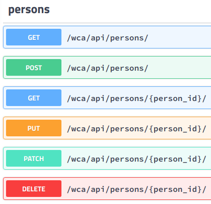

# WCA Data Django Application for SI 664 Fall 2018

## Purpose
Explore the data that is in the World Cube Association results database export

## Data Set
This Django application uses the World Cube Associaion results database export, which can be found  [here](https://www.worldcubeassociation.org/results/misc/export.html). This application uses the export from 11/27/2018.

## Data Model


## Package Dependencies
Taken from requirements.txt

* certifi
* chardet
* coreapi
* coreschema
* defusedxml
* Django
* django-allauth
* django-cors-headers
* django-crispy-forms
* django-filter
* django-rest-auth
* django-rest-swagger
* django-test-without-migrations
* djangorestframework
* idna
* itypes
* Jinja2
* Markdown
* MarkupSafe
* mysqlclient
* oauthlib
* openapi-codec
* pkg-resources
* PyJWT
* python3-openid
* pytz
* PyYAML
* requests
* requests-oauthlib
* simplejson
* six
* social-auth-app-django
* social-auth-core
* uritemplate
* urllib3

## Misc Notes:

* all filters, forms, and api stuff can take a while to load (a few minutes to maybe half an hour) but they will eventually load
* sql dump file is ~200MB so the sql dump is inside `yuxuanc-wca_database-dump-2018121921.zip` in `static/sql`
* the sql script that turns the WCA database export into a relational database can take ~30 hours to run
* my ID number in the application is 66687 with the WCA ID 2011CHEN54

### API endpoints


* POST: [http://localhost:8000/wca/api/persons/](http://localhost:8000/wca/api/persons/)
```
    {
        "person_identifier": "<WCA ID>",
        "person_name": "<person name>",
        "country_id": <country id number>,
        "gender": "<m. f, o, or none>",
        "result_ids": [<result id number>]
    }

```
* PUT: [http://localhost:8000/wca/api/persons/{person_id_number}/](http://localhost:8000/wca/api/persons/{person_id_number}/)
```
    {
        "person_identifier": "<WCA ID>",
        "person_name": "<person name>",
        "country_id": <country id number>,
        "gender": "<m, f, o, or none>",
        "result_ids": [<result id number>]
    }
```


